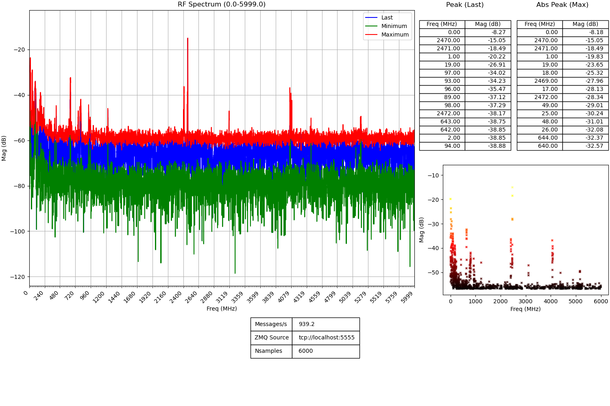

[](https://github.com/subreption/hackrf_sweeper/actions/workflows/pages/pages-build-deployment) [](https://github.com/subreption/hackrf_sweeper/actions/workflows/deploy_doxygen.yml) [](https://github.com/subreption/hackrf_sweeper/actions/workflows/build_linux.yml)

# HackRF Sweeper

> **A reimplementation of hackrf_sweep as a library: TSCM for Joe the plumber**




## Introduction

This is a refactoring or reimplementation of `hackrf_sweep` as a library, providing a carefully chosen API
to leverage the HackRF sweeping capabilities in a reusable, low-frustration fashion. The library provides
support for user-supplied callbacks to process raw transfer buffers or the already calculated FFT bins,
including a bypass mode to allow for entirely off-loading the data processing to the caller. It also
implements a rudimentary opaque mutex (locking) state for multi-thread applications.

A demo application is a re-implementation of the original `hackrf_sweep` tool as a CURVE-encrypted publisher
sending `msgpack` frames to any receivers subscribed to it. A companion demo application is included in
the form of a Python program that processes these frames and generates a real-time plot of the RF spectrum,
the last peak detections and the absolute peaks -maximum observed-.

Past projects attempting to provide similar capabilities include hackrf-spectrum-analyzer (https://github.com/pavsa/hackrf-spectrum-analyzer). `hackrf_sweeper` provides continuous sweeping support instead of one-shot sweeps, besides the aforementioned improvements.

We intend to design and develop a GNU Radio block related to this library.

## Highlights

 - Reusable state across multiple sweeps.
 - Ease of use for initialization and reconfiguration.
 - Support for user-supplied callbacks:
   - Raw USB transfer data access (with optional bypass mode disabling FFT processing).
   - *FFT bins ready* access.
 - Explicit error codes during configuration.
 - Support for external mutex APIs at the right places (better multi-thread tolerance).
 - Easy integration in third-party projects: minimal set of APIs needed to boot.
 - Developed with future merging into upstream hackrf in mind.

## Documentation

The documentation is automatically published upon changes to this repository at:

https://subreption.github.io/hackrf_sweeper/

### Generating locally
The documentation can be generated like so:

```
$ cd docs/doxygen
$ doxygen Doxyfile
$ ls -ln
total 124
-rw-rw-r-- 1 2300 2300 116467 Sep 30 18:42 Doxyfile
drwxrwxr-x 3 2300 2300   4096 Sep 30 18:54 html
drwxrwxr-x 2 2300 2300   4096 Sep 30 18:54 latex
```

## Building

### Dependencies

The library depends on `libhackrf` and FFTW. The ZMQ demo application requires `libczmq` and `libzmq`.

For Debian users:

```
sudo apt-get install libhackrf-dev libczmq-dev libzmq5 libmsgpack-dev
```

### Compilation

Clone this repository:

```
git clone https://github.com/subreption/hackrf_sweeper.git
cd hackrf_sweeper
```

Proceed with the usual CMake build process:

```
mkdir build
cd build
cmake ..
make all
```

### Running the demo ZMQ application

The user must generate keys conforming to the modern ZMQ certificate format:

```
./demo/hackrf_sweeper_zmq2plot.py -k ./test-keys -g
```

Once the keys for the server have been generated, the demo application can be run:

```
./build/hackrf_sweeper_zmqpub -S ./test-keys/server.key_secret
```

With `hackrf_sweeper_zmqpub` still running, the plotting demo application can be run like so:

```
./demo/hackrf_sweeper_zmq2plot.py -k ./test-keys -p ./test-keys/server.key
```

**Remember to specify a key directory to hold the CURVE certificates**.

## Reporting bugs

Please file an issue, or even better, provide a **tested** and **documented** PR. :-)

## Licensing

```
    Copyright 2024 Subreption LLC <research@subreption.com>

    This program is free software: you can redistribute it and/or modify
    it under the terms of the GNU General Public License as published by
    the Free Software Foundation, either version 3 of the License, or
    (at your option) any later version.

    This program is distributed in the hope that it will be useful,
    but WITHOUT ANY WARRANTY; without even the implied warranty of
    MERCHANTABILITY or FITNESS FOR A PARTICULAR PURPOSE.  See the
    GNU General Public License for more details.

    You should have received a copy of the GNU General Public License
    along with this program.  If not, see <https://www.gnu.org/licenses/>.
```
